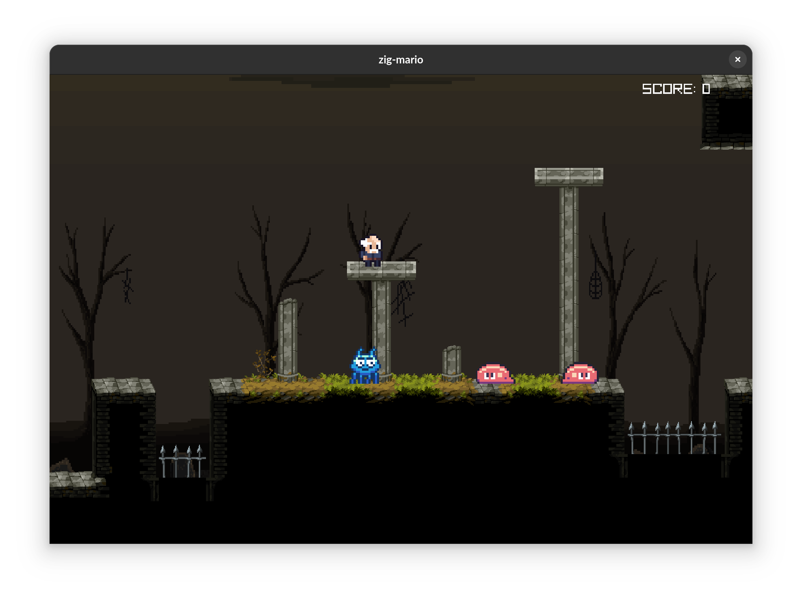

# zig-mario

> My implementation of `Super Mario` in [zig](https://ziglang.org/) using [raylib](https://github.com/Not-Nik/raylib-zig) and an [ECS](https://github.com/prime31/zig-ecs).



I'm working on this game as part of [The 20 Games Challenge](https://20_games_challenge.gitlab.io/). Super Mario is [Challenge #6](https://20_games_challenge.gitlab.io/challenge/#6).

## Goals

_source: [The 20 Games Challenge #6 (Super Mario)](https://20_games_challenge.gitlab.io/challenge/#6)_

- [x] Create a 2D character controller. Mario should be able to walk, run, and jump.
- [ ] Create a single level. You can make world 1-1, or design your own level. The level should be made up of textured tiles. There will also be some special elements:
  - [ ] Add “question mark” boxes. These will contain coins or power ups.
  - [ ] Add warp pipes. Mario should be able to enter these by pressing the “down” button. He will exit a pipe somewhere else on the map.
  - [ ] At the end of the level should be a castle and a flagpole. Touching the flagpole will end the level.
- [x] Add enemies to the level. Goombas will walk in a straight line and turn around when they hit something. Jumping on a Goomba will squash it.
- [ ] Add Koopas. Koopas will retreat into their shell when stomped on. The shell will move when hit again.
- [ ] Add power ups. A mushroom will cause Mario to increase in size. Feel free to add stars or fire flowers as well.
- [ ] Make your own sprites, sound effects, and music. Pay special attention to the artwork for repeating tiles, pattern should look good when repeated.
- [ ] Add a life counter and level timer. Mario will die if the timer reaches zero before he finds the level exit.

## TODO

- [ ] Make velocity consistent for different frame rates.
- [ ] Make sure `killPlayer` is only called once when colliding with multiple enemies in one frame.

## Playing the web version of the game

_TODO_

## Running the game

```sh
zig build run
```

## Building for the web

```sh
zig build -Dtarget=wasm32-emscripten
```

## Controls

| Key                | Description                 |
| ------------------ | --------------------------- |
| `H`, `Arrow Left`  | Move left                   |
| `L`, `Arrow Right` | Move right                  |
| `Space`            | Jump                        |
| `Enter`            | (_TODO_) Start/pause/resume |
| `F1`               | Toggle debug mode           |
| `F2`               | Toggle sounds/music         |
| `F3`               | Toggle camera zoom          |
| `Q`, `Escape`      | Quit game                   |

## Assets

List of all assets used in this game:

| File                                                                            | Source/Author                                                                                                     |
| ------------------------------------------------------------------------------- | ----------------------------------------------------------------------------------------------------------------- |
| `player.atlas.png`                                                              | [ULERINN: Old Man Character (modified)](https://ulerinn.itch.io/free-old-man)                                     |
| `enemies.atlas.png`                                                             | [ROTTING PIXELS: Enemy Character Pack ](https://rottingpixels.itch.io/enemy-characters-pack-free)                 |
| `map/background_layer_*.png`                                                    | [Free Pixel Art Fantasy 2D Battlegrounds](https://craftpix.net/freebies/free-pixel-art-fantasy-2d-battlegrounds/) |
| `map/tileset.png`                                                               | [ANOKOLISA: Moon Graveyard Tileset](https://anokolisa.itch.io/moon-graveyard)                                     |
| `map/map.tmj`, `map/tileset.tsj`                                                | [stefanpartheym](https://github.com/stefanpartheym) with [Tiled Map Editor](https://www.mapeditor.org/)           |
| `sounds/die.wav`, `sounds/hit.wav`, `sounds/jump.wav`, `sounds/pickup_coin.wav` | [stefanpartheym](https://github.com/stefanpartheym) with [rfxgen](https://raylibtech.itch.io/rfxgen)              |
